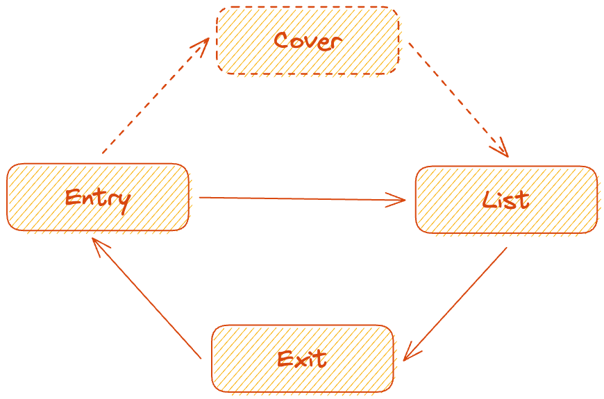

# Focus-no-Jutsu

[](https://996.icu) [](https://naruto.fandom.com/wiki/Genjutsu)

使用 focus-no-jutsu 管理和控制焦点，实现一个[键盘可访问的用户界面](https://www.w3.org/WAI/ARIA/apg/practices/keyboard-interface/)。

您可以任意选择鼠标和键盘来访问这个[使用 *focus-no-jutsu* 的范例网站](https://wswmsword.github.io/examples/focus-no-jutsu)。

网页程序里有很多需要管理和控制焦点的场景，例如弹窗、菜单、选项卡、抽屉等等。假设现在需要开发一个弹窗，有至少下面几个和焦点有关的部分要考虑：
- 在“打开”按钮上按下 <kbd>Enter</kbd>，弹窗内第一个元素获得焦点；
- 在弹窗的内部按住 <kbd>Tab</kbd>，焦点（中幻术）不能逃出弹窗；
- 点击弹窗的空白区域，按下反向 <kbd>Tab</kbd>，弹窗内的最后一个元素获得焦点；
- 在“关闭”按钮上按下 <kbd>Enter</kbd>，“打开”按钮获得焦点；
- 按下 <kbd>Esc</kbd>，或者点击弹窗背后的半透明蒙层，“打开”按钮获得焦点。

也许你希望能集中管理这些情况，同时希望能控制焦点导航的路径，还希望能有一个库，也许您就可以试试本项目的 focus-no-jutsu，focus-no-jutsu 集中管理焦点、控制焦点路径。

下面的文档会使用到几个关键词，分别是**入口**、**封面**、**列表**和**出口**，引入项目之后可以运用这几个关键词，来描述**如何进入焦点，进入后如何移动焦点，以及如何退出焦点**。

<details>
<summary>查看一个常规聚焦的流程。</summary>

<!--  -->

一个常规流程是这样的，开始焦点在*入口*，焦点通过*入口*到达*列表*，在*列表*中焦点可以自由移动，前进或者后退聚焦*列表*的每一个单项，*列表*中有些特殊的单项是*出口*，通过*出口*，焦点会从*列表*回到*入口*。

也有一些情况，*入口*和*列表*之间有*封面*，*出口*和*入口*之间也要有*封面*。

如果能像上面这样描述焦点的路径，就能用 focus-no-jutsu 完成工作。
</details>

<details>
<summary>在开发无障碍组件的时候需要控制焦点。</summary>

例如开发一个模态对话框，对话框的背景应该对所有用户隐藏，对于鼠标用户，鼠标不能访问背景元素，对于键盘用户，键盘不能访问背景元素，对于使用辅助设备的用户，辅助设备也不能访问背景元素。

这个项目可以控制从“打开”按钮开始、到对话框内导航、到“关闭”按钮结束，这个流程中焦点的路径，通过确定的焦点路径，避免聚焦到背景元素上。
</details>

> **Note**
>
> Focus-no-Jutsu 意为“聚焦术”。no-Jutsu 的发音为 /ˈnɔˌjutsu/，是日语里“の術”的发音，意为“……之术”，比如动漫《火影忍者》主角常用的忍术“[多重影分身之术](https://naruto.fandom.com/wiki/Multiple_Shadow_Clone_Technique)”，日语为“多重影分身*の術*”，读音为“Tajū Kage Bunshin *no Jutsu*”。

## 安装

> 开发中，等待发布至 npm。

## 使用

添加下面这两行代码后，焦点会在元素 `#firstTabbableNode` 和 `#lastTabbableNode` 之间陷入循环：

```javascript
import focus from "focus-no-jutsu";
focus(["#firstTabbableNode", "#lastTabbableNode"]);
```

只是这样编写和调用，也许不符合实际场景的应用，因为我们不会让焦点永远循环在一个范围里。举个例子，一个循环里至少会有一个“关闭”按钮，点击这个按钮，或者按下 <kbd>Esc</kbd>，焦点会逃出循环。

继续阅读查看关于选项的详细介绍，以了解如何管理“关闭”按钮之类的出口。

### focusNoJutsu(list[, options])

调用函数 `focusNoJutsu` 管理焦点，函数可以传递 2 个参数，`list` 表示焦点列表，第二个入参 `options` 是可选的，用于设定若干选项，例如设定入口、封面、列表和出口相关的详细配置。

### focusNoJutsu(root, list[, options])

调用函数 `focusNoJutsu` 管理焦点，函数可以传递 3 个参数，`root` 是 `list` 的祖先元素，将会被用来监听键盘（keydown）之类的事件，如果不提供 `root`，focus-no-jutsu 将会通过 `list` 找到最小公共祖先元素，第二个入参 `list` 表示列表，第三个 `options` 是可选的，用于设定若干选项。

<details>
<summary>
查看一种使用范例，范例演示了上面提到的“管理‘关闭’按钮和 <kbd>Esc</kbd>”。
</summary>

```javascript
import focus from "focus-no-jutsu"; // esm 方式引入
// const focus = require("focus-no-jutsu"); // cjs 方式引入

const dialog = document.getElementById("dialog");

// 循环焦点的根元素，对话框
focus(dialog, ["#head", "#tail"], { // 根元素 root 是 #dialog，根元素用来监听诸如 keydown 之类的事件，列表 list 的范围是从 #head 到 #tail，焦点如果进入列表，就会在这个范围循环
  // 入口配置
  entry: {
    // 入口的选择器字符串，例如“打开”按钮
    node: "#open",
    // 点击 #open 后的行为
    on: onEntry,
  },
  // 出口配置
  exit: {
    // 退出列表的出口元素，例如“关闭”按钮
    node: "#close",
    // 点击 #close 后的行为
    on: onExit,
  },
  // 按下 Esc 的行为
  onEscape: true,
});

/** 设置触发入口的行为 */
function onEntry() {
  dialog.classList.add("opened");
  dialog.classList.remove("closed");
}

/** 设置触发出口的行为 */
function onExit() {
  dialog.classList.add("closed");
  dialog.classList.remove("opened");
}
```

您也可以进入[范例文件夹](./examples/cjs/src/dialog.js)，通过运行范例文件夹，进行本地预览：

```bash
cd examples/cjs
npm i
npm run start
```

</details>

### root

**root**，`string | Element`，可以是一个 [Element](https://developer.mozilla.org/zh-CN/docs/Web/API/Element) 对象，也可以是一个 [DOMString](https://developer.mozilla.org/zh-CN/docs/Web/JavaScript/Reference/Global_Objects/String)。

根元素 `root` 将被用于监听键盘（keydown）事件，默认会监听按键 <kbd>Tab</kbd> 来控制焦点循环聚焦，如果开启了 `options.onEscape`，也会监听 <kbd>Esc</kbd>。

如果不提供这个参数，focus-no-jutsu 会取得列表 `list` 的最小公共祖先作为根元素 `root`。

### list

**list**，`(string | Element)[]`，是一个数组，数组内的元素可以是 [Element](https://developer.mozilla.org/zh-CN/docs/Web/API/Element) 对象，也可以是 [DOMString](https://developer.mozilla.org/zh-CN/docs/Web/JavaScript/Reference/Global_Objects/String)。

这个参数表示列表，默认情况下，数组 `list` 只需要两个元素，一个可聚焦的头元素，一个可聚焦的尾元素，如果传入的数组长度大于 2，将只取头和尾。这两个元素被用于确定按下 <kbd>Tab</kbd> 后的聚焦元素，识别到尾元素将跳转到头元素，按下 <kbd>Shift-Tab</kbd>，识别到头元素将跳转到尾元素。

设置 `options.sequence` 为 true 后，`list` 可以是一个长度大于 2 的序列，这时按下 <kbd>Tab</kbd> 后，将以 `list` 中元素的顺序进行聚焦。在设置 `options.next` 或 `options.prev` 后，`options.sequence` 默认为 true。

### options

下面的选项，除了 `trigger`、`entry`、`exit` 和 `cover`，其它选项都和列表相关。下面的每一个选项都是可选的。

| Name | Type | Default | Desc |
|:--|:--|:--|:--|
| sequence | boolean | false | 是否指定聚焦的元素，设置 true 则按顺序聚焦列表内每项元素 |
| loop | boolean | true | 是否循环聚焦，设置为 false，锁住焦点，焦点将停止在第一个和最后一个元素 |
| next | isKey \| subNodesForward | null | 自定义*前进*焦点函数，设置后，`sequence` 将默认为 true |
| prev | isKey \| subNodesForward | null | 自定义*后退*焦点函数，设置后，`sequence` 将默认为 true |
| trigger | element | null | 入口元素，用于退出列表时聚焦使用，如果在其它地方设置，可以忽略，例如设置 `entry.node` 后，不用设置 `trigger` |
| entry | enterSubNodes \| enterSubNodes[] | {} | 入口相关配置，进入列表 |
| exit | exitSubNodes \| exitSubNodes[] | {} | 出口相关配置，退出列表 |
| onEscape | false \| handleKeydown | null | 按下 <kbd>Esc</kbd> 的行为，如果未设置，默认取 `options.exit.on` |
| onClick | handleClick | null | 点击列表里的某一项后的行为 |
| moMove | handleMoveListItem | null | 移动的时候触发 |
| cover | boolean \| cover | false | 封面相关配置 |
| initialActive | number | 0 | 初始的 activeIndex，默认的初始的焦点位置 |
| correctionTarget | boolean \| getTarget | null | 焦点矫正 |
| delayToFocus | promiseDelay \| callbackDelay | null | 延迟聚焦，执行完 `options.entry.on` 后，等待执行 delayToFocus 完成后聚焦 |
| delayToBlur | promiseDelay \| callbackDelay | null | 延迟 blur，触发出口后等待执行 delayToBlur 完成后 blur |
| removeListenersEachExit | boolean | true | 每次退出列表回到入口是否移除列表事件 |
| removeListenersEachEnter | boolean | true | 每次进入列表后是否移除入口事件 |
| allowSafariToFocusAfterMousedown | boolean | true | 用于抹平 Safari 不同于其它浏览器，点击后 button 之类的元素不会被聚焦的问题 |

### options.next

| Name | Type | isRequired | Default | Desc |
|:--|:--|:--|:--|:--|
| key | isKey | N | null | 自定义在列表前进的组合键 |
| on | handleNextOrPrev | N | null | 前进时被执行，前进时的行为 |

### options.prev

| Name | Type | isRequired | Default | Desc |
|:--|:--|:--|:--|:--|
| key | isKey | N | null | 自定义在列表后退的组合键 |
| on | handleNextOrPrev | N | null | 后退时被执行，后退时的行为 |

<details>
<summary>
查看自定义按键聚焦的范例。
</summary>

下面的代码演示了使用 `→`、`↓` 和 `ctrl-n` 完成前进焦点，使用 `←`、`↑` 和 `ctrl-p` 完成后退焦点：
```javascript
import focus from "focus-no-jutsu";

const dialog = document.getElementById("dialog");

const isForward = e => (
  (e.ctrlKey && e.key === "n") ||
  e.key === "ArrowRight" ||
  e.key === "ArrowDown");

const isBackward = e => (
  (e.ctrlKey && e.key === "p") ||
  e.key === "ArrowTop" ||
  e.key === "ArrowLeft");

focus(dialog, ["#head", "#second", "#tail"], {
  entry: {
    node: "#open",
    on() {
      dialog.classList.add("openedDialog");
      dialog.classList.remove("closedDialog");
    },
  },
  exit: {
    node: "#close",
    on() {
      dialog.classList.remove("openedDialog");
      dialog.classList.add("closedDialog");
    },
  },
  next: isForward, // <----- 自定义*前进*焦点的配置项
  prev: isBackward, // <---- 自定义*后退*焦点的配置项
});
```

</details>

### options.entry

这些选项和入口相关，描述了如何通过入口进入封面或列表。下面的选项可以在一个对象里，也可以在由这个对象组成的数组里。下面的每一个选项都是可选的。

| Name | Type | Default | Desc |
|:--|:--|:--|:--|
| node | element | null | 入口元素，将用于监听点击事件，用于退出列表时聚焦使用 |
| key | iskey | null | 自定义进入列表组合键 |
| on | handleKeydown | null | 进入时被调用，进入列表前的行为，如果列表或封面在这里渲染，需要设置 `options.delayToFocus` 来延迟聚焦 |
| type | enterType[] | ["keydown", "click"] | 入口的监听方式 |
| target | element \| getTarget | null | 进入到哪个元素？ |
| delay | false \| promiseDelay \| callbackDelay | null | 延迟聚焦，触发 node 后等待执行 delay 完成后聚焦 |

### options.exit

这些选项和*出口*相关，描述了焦点如何从列表回到封面或入口。

| Name | Type | Default | Desc |
|:--|:--|:--|:--|
| node | element | null | 出口元素，将用于监听点击事件，用于退出列表时聚焦使用 |
| key | iskey | null | 自定义退出列表组合键 |
| on | handleKeydown | null | 退出时被调用，退出列表前的行为，如果有封面就退出至封面，如果没有就退出至入口，设置该选项后，按键按下 <kbd>esc</kbd> 同样生效 |
| type | exitType[] | ["keydown", "click"] | 出口的事件类型 |
| target | element | null | 退出至哪个元素？ |
| delay | false \| promiseDelay \| callbackDelay | null | 延迟失焦，触发 node 后等待执行 delay 完成后失焦 |

### options.cover

这些选项和封面有关，每个选项都是可选且默认值为空。

| Name | Type | Desc |
|:--|:--|:--|
| node | element | 封面元素，如果不指定，默认将取根元素 `root` |
| exit | exitCover \| exitCover[] | 退出封面 |
| enterKey | isKey | 自定义进入 subNodes 的组合键 |
| onEnter | handleKeydown | 进入 subNodes 时的行为 |

`options.cover.exit` 是一个有若干选项的对象，也可以是一个包含这类对象的数组。下面是 `options.cover.exit` 的所有选项，每一个选项都是可选的，且默认值为空：

| Name | Type | Desc |
|:--|:--|:--|
| key | isKey | 自定义退出封面的组合键 |
| on | handleKeydown | 退出封面时的行为 |
| target | element | 退出到哪个元素？ |

### Return

下面是调用函数 focusNoJutsu 后返回的属性。

| Name | Type | Desc |
|:--|:--|:--|
| enter | () => Promise\<void\> | 聚焦 `subNodes` 的头元素，如果自己管理入口元素的点击监听器，可以使用该方法 |
| exit | () => Promise\<void\> | 聚焦入口元素，例如 `trigger`，如果自己管理退出入口元素的点击监听器，可以使用该方法 |
| removeListeners | () => void | 移除所有的监听事件 |
| addEntryListeners | () => void | 添加入口的监听事件 |
| removeEntryListeners | () => void | 移除入口事件 |
| addListRelatedListeners | () => void | 添加列表相关（封面、列表、出口）的监听事件 |
| removeListRelatedListeners | () => void | 移除列表相关的事件 |
| addForward | (id: string, forward: forward \| getForward) => void | 添加转发 |
| removeForward | (id: string) => void | 移除转发 |
| updateList | (newList: element[]) => void | 更新列表 |
| i | (newI?: number) => number | 获取和设置当前焦点的编号 |

<details>
<summary>
查看使用 enter 和 exit 的一个范例。
</summary>

```javascript
import focusNoJutsu from "focus-no-jutsu";

const dialog = document.getElementById("dialog");
const openBtn = document.getElementById("#open");
const closeBtn = document.getElementById("#close");

const focus = focusNoJutsu(dialog, ["#head", "#tail"]);

openBtn.addEventListener("click", e => {
  dialog.classList.add("openedDialog");
  dialog.classList.remove("closedDialog");
  focus.enter(); // 聚焦 #head
})

closeBtn.addEventListener("click", e => {
  dialog.classList.remove("openedDialog");
  dialog.classList.add("closedDialog");
  focus.exit(); // 聚焦 #dialog
})
```

</details>

查看[使用 `addForward` 的一个范例](https://github.com/wswmsword/focus-no-jutsu/blob/main/examples/cjs/src/player.js)，这个范例中，`#grid_wrapper` 是一个中转节点，通过按下 <kbd>Tab</kbd> 和反向 <kbd>Tab</kbd>，焦点中转到 `#more_from`。

## 范例与开发

查看和运行范例：

```bash
cd examples/cjs # 进入使用 cjs 模块的范例文件夹
npm i # 安装依赖
npm run start # 本地运行
```

进行开发：

```bash
npm i
npm run start
```

运行之后，修改根目录的 index.js（focus-no-jutsu 主文件）和 `examples/run-start` 下的文件，即可在浏览器看到实时修改结果。

## 单元测试

```bash
npm i
npm run test
```

## CHANGELOG

查看[更新日志](./CHANGELOG.md)。

## 版本规则

查看[语义化版本 2.0.0](https://semver.org/lang/zh-CN/)。

## 协议

查看 [MIT License](./LICENSE)。

## 支持和赞助

请随意 Issue、PR 和 Star，通过[爱发电](https://afdian.net/a/george-chen)进行赞助。

## 其它

相关链接：
- [https://www.toptal.com/developers/keycode](https://www.toptal.com/developers/keycode)
- [Developing a Keyboard Interface](https://www.w3.org/WAI/ARIA/apg/practices/keyboard-interface/)
- [Keyboard Accessibility](https://webaim.org/techniques/keyboard/)